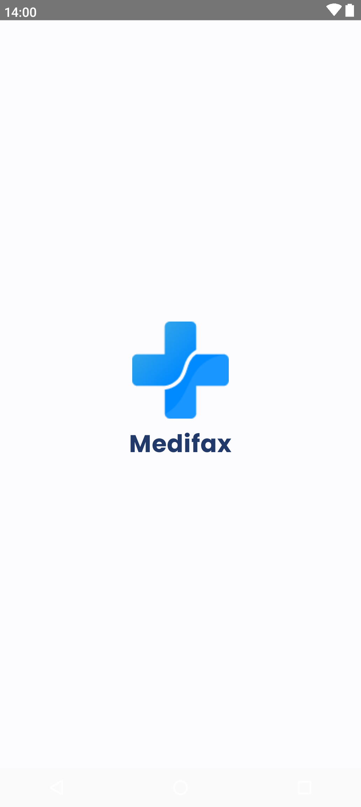
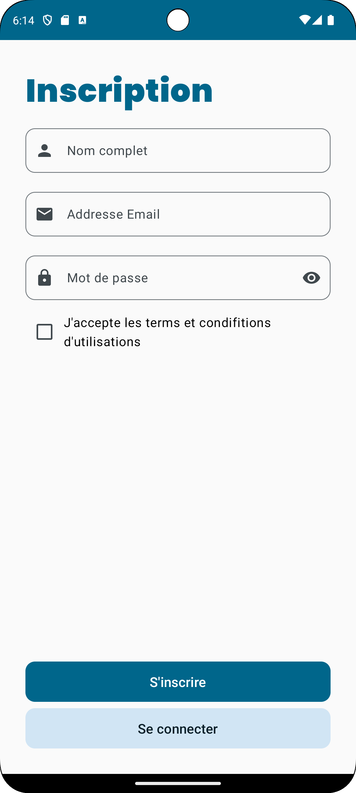
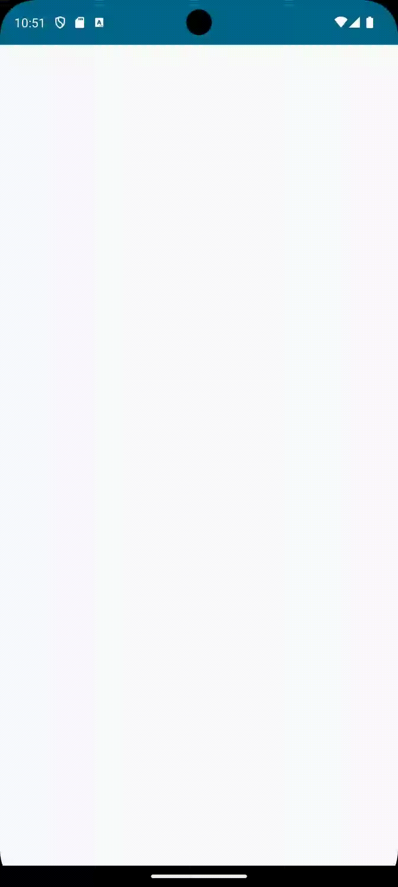

    

# Android Course Project

- TSHABU NGANDU BERNARD
- KAYOMBO KAKANGA Rusade
- KYANGWA NGONGA HENRIETTE
- Mukena Bunda Othniel
- CANSA KAYEMBE AMAURY
- Kinyanta Nkonkosha Daniel

L3 Informatique

## Description
Dans le domaine médical, la prise de rendez-vous est une étape cruciale pour assurer un
suivi adéquat des patients. Toutefois, les méthodes traditionnelles de prise de rendez-vous,
telles que les appels téléphoniques, peuvent se révéler fastidieuses et inefficaces. Dans le
cadre d’un petit projet visant à améliorer les processus internes d’un cabinet médical, nous
proposons l’adoption d’une plateforme de prise de rendez-vous en ligne, offrant une solution moderne et pratique. Cette introduction présentera les défis auxquels nous pourrions
être confrontés lors de la mise en place de ce projet, ainsi que les avantages considérables
qu’il peut apporter à notre cabinet médical.

En outre, l’utilisation d’une plateforme de prise de rendez-vous en ligne facilitera la gestion
administrative et réduira la charge de travail pour notre personnel. Les fonctionnalités
automatisées, telles que les rappels de rendez-vous et la gestion centralisée des horaires,
permettront d’optimiser l’organisation et d’éviter les conflits d’horaires. Cela se traduira par
une utilisation plus efficace des ressources et une amélioration de la productivité au sein du
cabinet médical.

## Screenshots

&nbsp;
&nbsp;
&nbsp;
&nbsp;

## assignment 2

code source :
- [EventHandlingScreen.kt](app/src/main/java/tech/devscast/medifax/ui/screens/EventHandlingScreen.kt)
- [TouchDrawingScreen.kt](app/src/main/java/tech/devscast/medifax/ui/screens/TouchDrawingScreen.kt)

&nbsp;
&nbsp;
